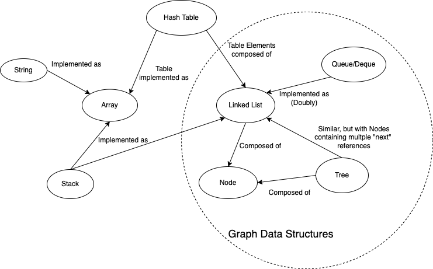

# Notes Data Structures

## Contents

* [Arrays](./arrays.md)
* [LinkedList](./linked_list.md)
* Stack TODO
* Queue TODO
* Hash Table TODO
* String TODO
* Trees TODO
* Graphs TODO

**Data Structures Map**

